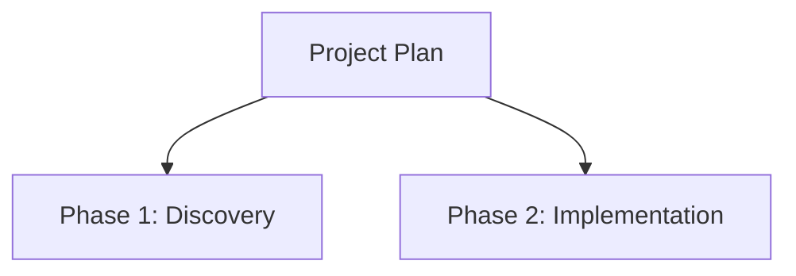

# SmartDocument — Hierarchical Knowledge Documents with Structural Rendering

## The Concrete Model

A **Smart Document** is a hierarchical knowledge document that commits to four contracts:

1. **Doc shape** — every node has `type`, `model_version`, `id`, `label`, `description`, `metadata`, `opts`, `children`, plus the diagram fields `shape` and `links`.
2. **Naming**: `<name>.smart.k.json` for the source; `<name>.smart.k.md` for the auto-generated rendering.
3. **Structural rendering**: the `.smart.k.md` always begins with an embedded Mermaid `flowchart TD` visualizing the top-level structure.
4. **Operational rules**: navigate by JSON Pointer (RFC 6901); mutate by JSON Patch (RFC 6902); never edit `.smart.k.json` or `.smart.k.md` directly.

The shape:

```json
{
  "type": "SmartDocument",
  "model_version": 1,
  "id": "...",
  "label": "...",
  "description": "...",
  "metadata": { ... },
  "opts": { ... },
  "shape": "rect",
  "links": [],
  "children": {
    "child_id": { "type": "SmartDocument", ... }
  }
}
```

### Content Scope — Information and Relations Only, No Code

**Smart Documents carry information and structured relations. They do not contain source code.**

What *belongs*:

- Prose descriptions, explanations, rationale, decisions
- Hierarchical structure (`children`)
- Relationships between nodes (`links`)
- Metadata about the document and its parts
- External references — URLs, file paths to code, citations
- Inline-formatted terms in backticks (`like_this`)

What does *not* belong:

- Source code in any language
- Multi-line code blocks (` ```python `, ` ```ts `, etc.)
- Implementation details that bind to specific syntax
- Generated artifacts

If you find yourself wanting to embed code: reference it by path, describe the behavior in prose, or move the code to its source tree and link to it. Smart Documents are about *what is, how it relates, and why*. Code lives elsewhere.

## File Naming Convention

The `.smart` suffix precedes `.k.json` / `.k.md`:

| Pair | Role |
|---|---|
| `<name>.smart.k.json` | Source of truth — the JSON document |
| `<name>.smart.k.md` | Auto-generated — markdown with embedded Mermaid |

The `.smart` suffix is the contract. If a knowledge document is hierarchical *and* benefits from structural visualization, name it `.smart.k.json`.

## Structural Rendering — Mermaid in Markdown

When a `.smart.k.json` is rendered to `.smart.k.md`, the markdown begins with a Mermaid diagram of the document's top-level structure, followed by the standard content rendering:

````markdown
# Project Plan



## Phase 1: Discovery
...
````

Rules for the Mermaid section:

- Always `flowchart TD` (top-down).
- Node identifier = the Doc's `id` field (must be Mermaid-safe — alphanumerics and underscores).
- Node label (the bracketed text) = the Doc's `label` field.
- Edges from each Doc to its direct `children`.
- Depth rendered: by default, root + immediate children (depth 1). Deeper nesting is controlled by `opts.diagram_depth`.
- The diagram is **auto-generated, never hand-edited**.

### Clickable Navigation in the Diagram

The auto-generated Mermaid diagram is **clickable**. Each tree-rendered child node is wired to navigate to its corresponding section in the same `.smart.k.md` file. Renderers that respect `click` directives (mermaid.live, VS Code preview, GitLab, Obsidian) provide interactive navigation; renderers that strip them for security simply lose the feature, and the diagram still renders correctly.

The diagram block emits `click <id> href "#<anchor>"` lines after the structural edges:

````markdown

````

Anchors are generated from each child's `label` using GitHub-flavored slug rules (lowercase; alphanumerics and hyphens). The same slug is the heading anchor in the rendered markdown, so click targets line up exactly. The Mermaid diagram doubles as an interactive table of contents.

## Node Shapes — Best Practices

Each SmartDocument node declares a `shape` (one of the `NodeShape` enum values) that controls its Mermaid rendering. Choose the shape that conveys the *role* of the node, not just its existence. Shape is meaning, not decoration.

### Reference: when to use each shape

| Shape | Mermaid | Use For | Avoid For |
|---|---|---|---|
| `rect` (default) | `[text]` | Generic services, components, modules, processes — the "ordinary thing" default | Decisions, persistent stores, actors |
| `rounded` | `(text)` | UI components, soft abstractions, lightweight services | Strict architectural or infrastructure roles |
| `stadium` | `([text])` | Entry / exit points, gateways, load balancers, lifecycle start/end | Mid-flow processes |
| `subroutine` | `[[text]]` | Subroutines, encapsulated nested processes, message queues | Top-level system components |
| `cylinder` | `[(text)]` | Databases, caches, file stores, S3 buckets — anything persistent | Stateless processes |
| `circle` | `((text))` | Users, external actors, third parties, the browser, foreign systems | Internal services |
| `asymmetric` | `>text]` | Signals, async triggers, one-sided flags | Generic components (rarely needed) |
| `rhombus` | `{text}` | Decision points, conditionals, branches, switches | Stateful components, services |
| `hexagon` | `{{text}}` | Preparation steps, configuration, initialization, setup | Runtime components |
| `parallelogram` | `[/text/]` | Input / output operations, data interchange at a boundary | Internal processing |
| `trapezoid` | `[/text\]` | Manual / human-in-the-loop steps | Fully automated processes |

### By section type — recommended shape palettes

| Section type | Recommended palette |
|---|---|
| **System architecture** | `rect` for services; `cylinder` for stores/caches; `circle` for users / external actors; `stadium` for entry points; `subroutine` for queues |
| **Decision flow** | `rhombus` at every decision; `rect` for steps; `stadium` for start/end; `parallelogram` for I/O |
| **Process / workflow** | `rect` for steps; `subroutine` for sub-processes; `trapezoid` for manual steps; `hexagon` for setup; `stadium` for start/end |
| **Knowledge tree / taxonomy** | `rect` or `rounded` for concepts; `circle` for external references |
| **Data pipeline** | `cylinder` for sources/sinks; `subroutine` for transformations; `stadium` for triggers; `parallelogram` for I/O |
| **Architecture / component model** | `rect` for components; `subroutine` for layers / bounded contexts; `cylinder` for persistence; `circle` for externals |

### Decision heuristics

When choosing a shape, ask in order:

1. Is this the **start or end** of something? → `stadium`
2. Is this a **decision point**? → `rhombus`
3. Is this **persistent storage**? → `cylinder`
4. Is this an **external actor / user**? → `circle`
5. Is this a **manual / human step**? → `trapezoid`
6. Is this **preparation / setup**? → `hexagon`
7. Is this **I/O at a boundary**? → `parallelogram`
8. Is this a **sub-process / queue / encapsulated routine**? → `subroutine`
9. Otherwise → `rect`

Stay conservative with the palette. A diagram with 11 different shapes is harder to read than one with 3–4 shapes used consistently.

## Edge Styles — Best Practices

Edges declared via `links` carry semantics that tree edges (parent → child) cannot. Choose the edge style for the *kind of relationship*.

| Style | Mermaid | Use For | Avoid For |
|---|---|---|---|
| `arrow` (default) | `A --> B` | Synchronous calls, control flow, primary dependency | Bidirectional relationships |
| `line` | `A --- B` | Peer relationships, equivalence, undirected association | Cases where direction matters |
| `thick` | `A ==> B` | Hot path, critical dependency, primary flow | Routine connections |
| `dotted` | `A -.-> B` | Async / background, fallback, optional, planned, deferred | Synchronous critical flows |
| `invisible` | `A ~~~ B` | Layout hint only — forcing alignment without a visible edge | Real relationships |

**Always label non-obvious edges.** A labeled edge (`"HTTP"`, `"publishes"`, `"reads"`) communicates far more than an unlabeled one.

## Tree Edges vs. Links — When to Use Which

A SmartDocument is hierarchical via `children`, but supports cross-cutting `links`. The tree captures **containment** ("B is part of A's structure"); links capture **interaction** ("A calls B", "A depends on B").

| If the relationship is… | Express it as |
|---|---|
| "B is a part of A" / "B is contained in A" | `children` (tree edge) |
| "A calls B" / "A invokes B" | `links` |
| "A depends on B" | `links` |
| "A produces data consumed by B" | `links` |
| "B is a sub-component of A" | `children` |
| "A and B are peers in the same system" | both as `children` of the parent, plus `links` between them |

Common mistake: putting everything in `children` when the actual relationships are flows. Result: a tidy hierarchy that says nothing about how the system operates. If two siblings interact, the interaction belongs in `links`, not in nested `children`.

## Auto-Detection and Correction of Node Shapes

**Shape is presentational, not structural.** A node's `shape` field is independent of its `id`, `children`, `links`, and content. Changing a shape never restructures the document — it's a single-field JSON Patch:

```json
[
  {"op": "test", "path": "/children/users_db/shape", "value": "rect"},
  {"op": "replace", "path": "/children/users_db/shape", "value": "cylinder"}
]
```

The Mermaid diagram rebuilds on the next render. Nothing else moves.

### Detect proactively

When entering a working session on a Smart Document, scan the existing nodes and infer the right shape for each from context. The conventions above are sensible defaults for nodes whose role is unambiguous.

Inference signals, in roughly this order of strength:

1. **Label semantics** — the strongest signal:
   - `"Database"`, `"DB"`, `"Cache"`, `"Store"`, `"Index"` → `cylinder`
   - `"User"`, `"Client"`, `"Customer"`, `"Browser"` → `circle`
   - `"API Gateway"`, `"Load Balancer"`, `"Entry"` → `stadium`
   - `"Decision"`, `"Check"`, `"Validate"` (when branching) → `rhombus`
   - `"Queue"`, `"Worker"`, `"Subroutine"` → `subroutine`
   - `"Config"`, `"Setup"`, `"Init"` → `hexagon`
   - `"Read"`, `"Write"`, `"Input"`, `"Output"` (at boundary) → `parallelogram`
   - `"Manual"`, `"Approve"`, `"Review"` (when manual) → `trapezoid`
2. **Position in the hierarchy** — leaf nodes at system boundaries skew toward `circle` or `stadium`; interior nodes default to `rect`.
3. **Section type** — system-design sections favor `cylinder` for stores; workflow sections favor `rhombus` for decisions.
4. **Peer consistency** — if surrounding sibling nodes are mostly `rect`, an ambiguous node defaults to `rect` for visual coherence.

### Correct cheaply

If you detect a shape mismatch, correct it with a single JSON Patch. Never restructure.

```json
[
  {"op": "replace", "path": "/children/users_db/shape", "value": "cylinder"},
  {"op": "replace", "path": "/children/cache/shape", "value": "cylinder"},
  {"op": "replace", "path": "/children/customer/shape", "value": "circle"}
]
```

### Workflow

When you begin working on a Smart Document and notice shape mismatches:

1. **Scan** — read each node's `id`, `label`, and current `shape`.
2. **Infer** — determine the shape its label and role suggest.
3. **Flag mismatches** — produce a short list of nodes whose current shape disagrees with the inferred one.
4. **Surface to the user** with rationale.
5. **Apply on approval** — one JSON Patch with one `replace` per correction. No structural changes.

Lightweight and proactive: surface only the nodes that look wrong, not an exhaustive audit.

## When to Invoke This Skill

Use the SmartDocument workflow when:

- The user asks to read, modify, add, or remove a **specific part** of a `.smart.k.json` document.
- The user is navigating into a section / item / concept inside a Smart Document.
- A JSON Patch needs to be constructed for a `.smart.k.json`.
- The user is creating a new hierarchical knowledge document that benefits from structural visualization.

Do not use this skill when:

- The file is not `.smart.k.json`.
- The user is reviewing the document holistically — read the file directly without the part-level workflow.

## Working Session Discipline — Stay in the Workflow

**Once the user begins working on a Smart Document, the SmartDocument workflow becomes active for that document and remains active for the duration of the session on it.** This is a stickiness rule, not a one-shot trigger.

The moment the user reads a part, navigates to a section, requests a change, asks a question about a specific location, or constructs a JSON Patch on a `.smart.k.json` file, the entire workflow is engaged. From that point onward:

- **All related actions on that document stay inside this workflow.** Do not break out to direct file edits, ad-hoc parsing, or prose-only descriptions of changes.
- **All documentation about the current document** is expressed in SmartDocument terms: JSON Pointer paths for locations, JSON Patch for mutations, the Doc / children shape for structure.
- **Follow-up requests on the same document continue the workflow without resetting.** If the previous turn applied a patch to `phase_2`, and the next turn asks to update `phase_3`, apply the same navigate → patch → verify cycle. Do not revert to base behavior between turns.
- **The session ends only when** the user explicitly switches to a different document, switches files, or asks for a different kind of work.

Concretely:

- ✅ User asks to update a section → JSON Pointer to locate it → JSON Patch to change it → verify the regenerated `.smart.k.md`.
- ✅ User then asks "what's in section X?" → continue with JSON Pointer navigation; show only that subtree.
- ✅ User then asks "add a new sibling under phase_2" → continue with `add` JSON Patch op at the right path.
- ❌ User asks "rewrite the description" → do NOT use `Edit` or `Write` on the `.smart.k.json`; build a JSON Patch.
- ❌ User asks "what's the current label of phase_3" → do NOT dump the whole document; walk to `/children/phase_3/label` and show only that.

## Core Operations

### 1. Navigate — locate a part by JSON Pointer

Every node in a Smart Document is addressable by a JSON Pointer path:

| Path | Refers to |
|---|---|
| `/` | The root Doc |
| `/label` | The root's display label (used as Mermaid root node text) |
| `/metadata/<key>` | A metadata field at root |
| `/children/<child_id>` | A first-level child Doc |
| `/children/<a>/children/<b>` | A nested Doc |
| `/children/<a>/shape` | The shape field of a child |
| `/children/<a>/links` | The cross-cutting links of a child |

Always express navigation as a JSON Pointer. Convert prose like *"the second phase"* into `/children/phase_2` before proceeding.

### 2. Read — inspect a part, not the whole document

1. Use the `Read` tool on the `.smart.k.json` file.
2. Walk to the JSON Pointer path.
3. Show the user only the relevant subtree.

Smart Documents can be large. Reading parts means reading parts.

### 3. Mutate — JSON Patch only

Apply changes via JSON Patch (RFC 6902). Never use direct `Edit` or `Write` on `.smart.k.json`.

Supported JSON Patch ops:

| Op | Use For |
|---|---|
| `add` | Insert a field, child Doc, or array element |
| `remove` | Delete a field or child Doc |
| `replace` | Update a field's value in place |
| `move` | Relocate a node (e.g., reorder siblings) |
| `copy` | Duplicate a node |
| `test` | Assert a precondition before applying changes |

**Use `test` defensively.** Before any `replace` or `remove` on a non-trivial value, prepend a `test` op confirming the current value. This makes the patch idempotent and safe to retry.

**Mutations that change structure regenerate the Mermaid.** `add` / `remove` / `move` on `/children/...` will redraw the diagram. Plan structural changes carefully — they show up at the very top of the rendered document.

### 4. Verify — after mutation

The `.smart.k.md` is auto-regenerated, including the Mermaid diagram. Confirm the regenerated diff matches intent — both the structural diagram *and* the content body.

## Patch Construction Idioms

**Defensive replace:**

```json
[
  {"op": "test", "path": "/children/phase_1/label", "value": "<current>"},
  {"op": "replace", "path": "/children/phase_1/label", "value": "<new>"}
]
```

**Inserting a new child Doc (will appear in the Mermaid diagram):**

```json
[
  {"op": "add", "path": "/children/phase_4",
   "value": {
     "type": "SmartDocument",
     "model_version": 1,
     "id": "phase_4",
     "label": "Phase 4: Rollout",
     "description": "...",
     "metadata": {},
     "shape": "rect",
     "links": [],
     "children": {}
   }}
]
```

**Removing a node only if it exists with the expected shape:**

```json
[
  {"op": "test", "path": "/children/old_phase/id", "value": "old_phase"},
  {"op": "remove", "path": "/children/old_phase"}
]
```

**Renaming a node (move op):**

```json
[
  {"op": "move", "from": "/children/phase_2", "path": "/children/phase_2_renamed"}
]
```

## Anti-Patterns

- ❌ Editing `.smart.k.json` directly with `Edit` or `Write`. Apply changes via JSON Patch.
- ❌ Editing `.smart.k.md` files. They are auto-generated and read-only — including the Mermaid block.
- ❌ Hand-editing the Mermaid block in `.smart.k.md`. The diagram is always rebuilt from the JSON structure.
- ❌ Reading the entire document when only a part is needed.
- ❌ Describing locations in prose instead of JSON Pointer paths.
- ❌ Applying `replace`/`remove` without a guarding `test` op when the current value is uncertain.
- ❌ Bulk-rewriting `children` when surgical `add`/`remove`/`replace` per path will do.
- ❌ Naming a hierarchical document `.k.json` when it commits to structural visualization — use `.smart.k.json` so the rendering contract is explicit.
- ❌ Using non-Mermaid-safe characters in `id` fields (only alphanumerics and underscores) — the diagram won't render.
- ❌ Using more than 4–5 different shapes in one diagram. Pick a consistent palette for the section type and reuse it.
- ❌ Using `circle` for internal services. Circles are reserved for external actors, users, and foreign systems.
- ❌ Using `rhombus` for anything other than a real decision point.
- ❌ Using `cylinder` for stateless processes. Cylinders mean persistence.
- ❌ Putting flow relationships in `children` instead of `links`.
- ❌ Adding a `links` entry that duplicates a tree edge (parent → child).
- ❌ Leaving non-obvious edges unlabeled.
- ❌ Embedding source code or multi-line code blocks in a Smart Document.
- ❌ Treating the Smart Document as a mini wiki for everything.

## Skills Used

| Skill | Relationship |
|---|---|
| `knowledge_document_tools` (plugin skill) | Owns the `${PLUGIN_ROOT}/bin/create-knowledge-document` and `${PLUGIN_ROOT}/bin/patch-knowledge-document` binaries that SmartDocument calls. Defer to that skill for tool arguments, supported model types, and error handling — SmartDocument does not duplicate that documentation. |

## Quick Reference

```
File pair:  <name>.smart.k.json  ←  source of truth
            <name>.smart.k.md    ←  auto-rendered (Mermaid + content)

Navigate:   JSON Pointer (RFC 6901)  /children/X/children/Y/metadata/Z
Read:       Read tool → walk path → show only the subtree
Mutate:     Apply JSON Patch (RFC 6902) — never edit directly
Verify:     Confirm regenerated .smart.k.md (Mermaid + content)
```
