# Dimensions Framework

```mermaid
flowchart TD
    dimensions_framework["Dimensions Framework"]
    application(("The Application"))
    dimensions["Dimensions"]
    data_dimension["Data Dimension"]
    visual_dimension["Visual Dimension"]
    web_dimension["Web Dimension"]
    cli_dimension["CLI Dimension"]
    performance_dimension["Performance Dimension"]
    plugins[["Plugins"]]
    subject_identification["Subject Identification"]
    observation_emission["Observation Emission"]
    envelope_lifecycle["Envelope Lifecycle"]
    artifact_attachment["Artifact Attachment"]
    framework_primitives["Framework Primitives"]
    injection_protocol(["Injection Protocol"])
    envelope["Envelope"]
    snapshot_envelope["Snapshot Envelope"]
    spec_envelope["Spec Envelope"]
    report_envelope["Report Envelope"]
    observation_kinds["Observation Kinds"]
    schema_generation{{"JSON Schema Generation"}}
    rendering["Rendering"]
    text_renderer["Text Renderer"]
    markdown_renderer["Markdown Renderer"]
    allure_renderer["Allure Renderer (planned)"]
    identifiers["Identifiers"]
    entity_id["entity_id"]
    ui_path["UIPath"]
    screen_map["Screen Map"]
    review["Review"]
    comment_model["Comment & Resolution Models"]
    sidecar_storage[("Sidecar Storage")]
    cli_comment_commands["CLI Commands"]
    inline_review["Inline Review (Phase A)"]
    comments_service[["Comments Service (Phase B)"]]
    validation["Validation"]
    fixture_protocols["Fixture Protocols"]
    scenarios["Scenarios"]
    replay_harness["Replay Harness"]
    generic_properties["Generic Properties"]
    roadmap{{"Roadmap"}}
    ui_path_adoption["UIPath Adoption (PR3)"]
    hypothesis_corpus["Hypothesis Corpus"]
    llm_discovery["LLM Discovery"]
    intentional_change_approval["Intentional Change Approval"]
    determinism_image{{"Determinism Image"}}
    dimensions_framework --> application
    dimensions_framework --> dimensions
    dimensions --> data_dimension
    dimensions --> visual_dimension
    visual_dimension -->|"emits"| screen_map
    dimensions --> web_dimension
    dimensions --> cli_dimension
    dimensions --> performance_dimension
    dimensions_framework --> plugins
    plugins -->|"observe"| application
    plugins -->|"emit data for"| dimensions
    plugins -. "self-tested via" .-> validation
    plugins --> subject_identification
    plugins --> observation_emission
    observation_emission -->|"validated by"| schema_generation
    plugins --> envelope_lifecycle
    plugins --> artifact_attachment
    plugins --> framework_primitives
    plugins --> injection_protocol
    injection_protocol -->|"mirrored by"| fixture_protocols
    dimensions_framework --> envelope
    envelope -->|"stamped with"| entity_id
    envelope --> snapshot_envelope
    envelope --> spec_envelope
    envelope --> report_envelope
    envelope --> observation_kinds
    envelope --> schema_generation
    schema_generation -->|"validates"| snapshot_envelope
    schema_generation -->|"validates"| spec_envelope
    schema_generation -->|"validates"| report_envelope
    dimensions_framework --> rendering
    rendering -->|"reads"| snapshot_envelope
    rendering -->|"produces"| report_envelope
    rendering -->|"embeds"| inline_review
    rendering --> text_renderer
    rendering --> markdown_renderer
    rendering --> allure_renderer
    dimensions_framework --> identifiers
    identifiers -->|"stamps"| envelope
    identifiers --> entity_id
    entity_id -->|"primary anchor"| comment_model
    entity_id -->|"asserted unique by"| generic_properties
    identifiers --> ui_path
    ui_path -->|"keys of"| screen_map
    ui_path -->|"step target type"| scenarios
    ui_path -. "alternative anchor" .-> comment_model
    identifiers --> screen_map
    screen_map -->|"emitted by"| visual_dimension
    screen_map -. "consumed by" .-> llm_discovery
    dimensions_framework --> review
    review -->|"embedded in"| rendering
    review -->|"anchors to"| entity_id
    review --> comment_model
    review --> sidecar_storage
    review --> cli_comment_commands
    review --> inline_review
    review --> comments_service
    comments_service -->|"read/write"| sidecar_storage
    comments_service -->|"serves"| rendering
    dimensions_framework --> validation
    validation -->|"tests"| plugins
    validation -->|"asserts shape of"| envelope
    validation --> fixture_protocols
    fixture_protocols -. "intercepts seam of" .-> plugins
    fixture_protocols -->|"sibling impl of"| injection_protocol
    validation --> scenarios
    scenarios -->|"replayed via"| fixture_protocols
    validation --> replay_harness
    replay_harness -->|"loads"| scenarios
    replay_harness -->|"runs"| generic_properties
    validation --> generic_properties
    generic_properties -->|"round-trips"| envelope
    dimensions_framework --> roadmap
    roadmap --> ui_path_adoption
    ui_path_adoption -->|"promotes"| ui_path
    ui_path_adoption -->|"retypes target"| scenarios
    ui_path_adoption -->|"extends anchor"| comment_model
    ui_path_adoption -->|"adds overlay"| rendering
    roadmap --> hypothesis_corpus
    hypothesis_corpus -->|"produces"| scenarios
    hypothesis_corpus -. "extends" .-> validation
    roadmap --> llm_discovery
    llm_discovery -->|"consumes"| screen_map
    llm_discovery -->|"produces"| scenarios
    roadmap --> intentional_change_approval
    intentional_change_approval -->|"mutes approved in"| rendering
    intentional_change_approval -->|"rule-level approval surface"| review
    roadmap --> determinism_image
    determinism_image -->|"runs in"| visual_dimension

    click application href "#the-application" _self
    click dimensions href "#dimensions" _self
    click data_dimension href "#data-dimension" _self
    click visual_dimension href "#visual-dimension" _self
    click web_dimension href "#web-dimension" _self
    click cli_dimension href "#cli-dimension" _self
    click performance_dimension href "#performance-dimension" _self
    click plugins href "#plugins" _self
    click subject_identification href "#subject-identification" _self
    click observation_emission href "#observation-emission" _self
    click envelope_lifecycle href "#envelope-lifecycle" _self
    click artifact_attachment href "#artifact-attachment" _self
    click framework_primitives href "#framework-primitives" _self
    click injection_protocol href "#injection-protocol" _self
    click envelope href "#envelope" _self
    click snapshot_envelope href "#snapshot-envelope" _self
    click spec_envelope href "#spec-envelope" _self
    click report_envelope href "#report-envelope" _self
    click observation_kinds href "#observation-kinds" _self
    click schema_generation href "#json-schema-generation" _self
    click rendering href "#rendering" _self
    click text_renderer href "#text-renderer" _self
    click markdown_renderer href "#markdown-renderer" _self
    click allure_renderer href "#allure-renderer-planned" _self
    click identifiers href "#identifiers" _self
    click entity_id href "#entity-id" _self
    click ui_path href "#uipath" _self
    click screen_map href "#screen-map" _self
    click review href "#review" _self
    click comment_model href "#comment-resolution-models" _self
    click sidecar_storage href "#sidecar-storage" _self
    click cli_comment_commands href "#cli-commands" _self
    click inline_review href "#inline-review-phase-a" _self
    click comments_service href "#comments-service-phase-b" _self
    click validation href "#validation" _self
    click fixture_protocols href "#fixture-protocols" _self
    click scenarios href "#scenarios" _self
    click replay_harness href "#replay-harness" _self
    click generic_properties href "#generic-properties" _self
    click roadmap href "#roadmap" _self
    click ui_path_adoption href "#uipath-adoption-pr3" _self
    click hypothesis_corpus href "#hypothesis-corpus" _self
    click llm_discovery href "#llm-discovery" _self
    click intentional_change_approval href "#intentional-change-approval" _self
    click determinism_image href "#determinism-image" _self
```

## Contents

- [The Application](#the-application)
- [Dimensions](#dimensions)
- [Plugins](#plugins)
- [Envelope](#envelope)
- [Rendering](#rendering)
- [Identifiers](#identifiers)
- [Review](#review)
- [Validation](#validation)
- [Roadmap](#roadmap)

A framework for observing software systems across multiple dimensions of behavior, comparing observations across time, and producing reviewable evidence of change.

## The Application

The system under observation — whatever software the framework is configured to watch. The framework treats it as opaque and reads only the artifacts the application exposes.

## Dimensions

The catalog of observation lenses. The framework recognizes five canonical dimension categories; the catalog is extensible.

### Data Dimension

Files, schemas, content integrity, distributions. Subject kind: file.

### Visual Dimension

UI rendering, layout, accessibility, computed styles. Subject kind: url.

### Web Dimension

HTTP / RPC API surfaces, request and response shapes. Subject kind: endpoint.

### CLI Dimension

Command-line tool behavior, exit codes, output structure. Subject kind: command.

### Performance Dimension

Latency, throughput, memory, allocations, span trees. Subject kind: workload.

## Plugins

The collectors. Each plugin is a small adapter that reads the application through one dimension and emits typed observations into the framework.

### Subject Identification

How a plugin identifies what it observed. The plugin returns a subject dict (kind, path / url / endpoint / command / workload, plus per-category fields) that becomes part of the envelope and pins the snapshot to a specific source.

### Observation Emission

How a plugin emits typed observations. The framework provides six observation builders — scalar, boolean, rule_check, set, distribution, histogram — and the plugin calls them on the envelope. The framework validates each emission against the JSON Schema; malformed observations reject the whole envelope.

### Envelope Lifecycle

The plugin enters the envelope as a context manager via ctx.envelope(...); observations and attachments are accumulated; on context exit the framework validates and persists the envelope. Plugins never open files for output, never serialize JSON, and never touch the storage backend.

### Artifact Attachment

Plugins may attach raw artifacts (binary files, in-memory blobs) to an envelope via env.attach_file or env.attach. Decoders registered with the framework convert the attached form into JSON so the structural diff can compare it.

### Framework Primitives

The toolkit plugins consume to do their work. CollectionContext methods (ctx.envelope, ctx.read_json, ctx.read_file, ctx.run, ctx.fetch_http, ctx.walk_files), envelope observation builders (env.scalar, env.boolean, env.rule_check, env.set, env.distribution, env.histogram), and env.attach_file / env.attach. A primitive enters this toolkit only when at least two plugins re-implement the same logic — speculative additions are rejected.

### Injection Protocol

The seam between plugin and the outside world. Each dimension's plugin depends on an abstract protocol — BrowserProtocol for visual, DataProtocol for data, WebProtocol for web — that the plugin drives to obtain raw observations. The framework provides one default real implementation per protocol (Playwright for BrowserProtocol). Sibling implementations (fakes, recorders, fixture replay) plug in without touching the plugin code. This is what makes the framework testable, mockable, and reproducible.

#### BrowserProtocol

Visual-dimension protocol: render a URL, return a PageState (DOM walk + computed styles + bbox + screenshot). Default implementation is PlaywrightBrowserProtocol, which drives Chromium. PageState is the typed contract — every browser implementation, real or fake, must produce one.

#### DataProtocol

Data-dimension protocol: read a file path, return a DataState (raw bytes, parsed JSON, schema match results). Default implementation reads from the local filesystem. Sibling implementations replay fixtures or stream from cloud storage.

#### WebProtocol

Web-dimension protocol: send a request to an endpoint, return a WebState (status, headers, body, timing). Default implementation uses httpx. Sibling implementations replay recorded responses (mitmproxy-style) for deterministic testing.

## Envelope

The framework-owned wrappers around captured, contracted, and rendered data. All envelope types are .json files validated against JSON Schemas that are auto-generated from Pydantic models. Three distinct envelope types serve different purposes in the workflow: snapshots (collected data), specs (plugin contracts), and reports (rendered comparisons).

### Snapshot Envelope

Captured observations from one plugin run. Persisted as .snap.json under the storage backend, validated against the Pydantic-generated JSON Schema. Operational, regenerable, gitignored.

### Spec Envelope

Plugin contract specification declaring what a plugin commits to observe — subject kind, observation ids, severity policy. Persisted as .spec.json, validated against the Pydantic-generated JSON Schema. Authored alongside plugin code; reviewed in PR with the plugin.

### Report Envelope

Rendered diff between two snapshots, frozen as a decision artifact. Persisted as .report.json, validated against the Pydantic-generated JSON Schema. Generated by the framework; committed for review or archive.

### Observation Kinds

The six-kind taxonomy that every observation reduces to. Plugins emit observations strictly through these kinds; the framework's diff and render dispatch on the kind. The taxonomy is closed by design — adding a kind is a framework-level change, not a plugin-level one.

#### Scalar

A single named numeric or string measurement — count, latency, size, version, hash. Shape: { value, unit? }. Diff: before / after / delta when numeric.

#### Boolean

A binary property — passed / failed, present / missing, enabled / disabled. Shape: { value }. Diff: state transition (true → false or false → true).

#### Rule Check

A schema, pattern, or invariant rule applied to N items. Shape: { passed, violations_count, violations_sample, checked_count? }. Diff: passed-state transitions, new violations, resolved violations, scope changes (checked_count delta). The primary kind for catching regressions.

#### Set

An unordered, deduplicated collection — inventory of headings, top-level keys, supported file extensions, available components. Shape: { items: [...] }. Diff: added / removed items.

#### Distribution

A keyed count map — tag counts, value-type distribution, status code frequency, error category breakdown. Shape: { buckets: { key: count } }. Diff: added / removed buckets, per-bucket count delta.

#### Histogram

A frequency table with top-N preserved plus totals. Shape: { top_n: [...], total, unique }. Diff: total / unique deltas, top-N membership changes. Suited to high-cardinality data where the full distribution is too large but the head is informative.

### JSON Schema Generation

Pydantic models in dimensions/schema/ are the canonical envelope contracts. A generator (dimensions/schema/_generate.py) auto-produces JSON Schema files in dimensions/schema/_generated/ that external tools, cross-language plugins, and CI validators consume. The Pydantic model is the source of truth; the JSON Schema is the public-facing contract. Re-running the generator is the only way to update the schemas — they are never hand-edited. This is the indirection that decouples the public envelope contract from its internal Pydantic implementation.

## Rendering

How the framework converts envelopes into reviewable output. Current renderers: text and markdown. Planned: Allure. Each renderer is a pure adapter — reads an envelope, writes the target format. Plugins have no knowledge of rendering.

### Text Renderer

Plain-text rendering of envelopes and diffs. Used by the CLI for terminal output. The default renderer — no extra dependencies, present everywhere the framework runs.

### Markdown Renderer

Markdown rendering of envelopes and diffs. Used for review surfaces that consume markdown — pull request review, knowledge documents, web previews. Section headings, comparison tables, and inline observation deltas.

### Allure Renderer (planned)

Planned. Translates envelopes and diffs into Allure-compatible JSON files. Allure is the most tunable existing review UI: severity filtering, labels for grouping, custom defect categories, attachments, parameters, and run-over-run history that visualizes the convergence trail. Open source (Apache 2.0), file-based, local-first via `allure serve <results-dir>`. The renderer is a pure adapter — reads an envelope, writes Allure JSON; no business logic.

## Identifiers

First-class content-derived identifier primitives. Every observation gets an entity_id; every UI element gets a UIPath; every screen has a Screen Map indexed by UIPath. These are the address space the rest of the framework refers to — stable across recapture, validatable against the captured snapshot, deterministically derivable.

### entity_id

Content-derived stable id stamped on every observation by the framework's EnvelopeBuilder. Hash of (dimension, envelope_name, observation_id, kind, payload_schema) → e_<16-hex>. Same logical observation always gets the same id; recapture preserves it. Implemented in dimensions/api.py via EnvelopeBuilder._stamp_entity_id; surfaced as an optional observation field via the Pydantic schema.

### UIPath

Canonical, content-derived locator for one element on one screen. Class-free, recapture-stable, human-readable, deterministically resolvable. Bridges every layer that needs to refer to a UI element — diff matching, comment anchoring, scenario steps, LLM-generated tests. Naming note: not a standard term — closest siblings are CSS Selectors, XPath, Playwright Locators, ARIA tree paths. The grammar is defined within the framework.

#### Grammar (pinned in PR2)

Pinned BNF: UIPath := segment (' > ' segment)*; segment := tag selector*; selector := '[testid=...]' | '[id=...]' | '[role=...]' | '[name=...]' | '[class=...]' | ':nth(N)'. The canonical form for any node is the shortest path that resolves to exactly one element. Selector priority drives canonicalization: testid → id → role+name → name → class → :nth.

#### Stability Tier

Per-path classification — STRONG (testid or id present in chain), MEDIUM (role+name or name attributes), WEAK (pure structural / :nth fallback). Reports surface the tier inline so reviewers see anchor risk; CI lint can reject WEAK-only Scenario steps. Pushes app teams toward adding testids where it matters.

#### Operations

Two contracts the framework guarantees: parse/format round-trip (parse(format(p)) == p) and resolve-after-derive (from_node(n, walk).resolve(walk) is n). Both pinned by hypothesis tests in PR2. Resolve returns 0 or 1 nodes, never multiple — a path that resolves to multiple was not derived canonically and the call returns None.

### Screen Map

A flat per-screen JSON listing every meaningful UIPath with its role, accessible name, bbox, interactivity, and stability tier. Smaller (5–50×) and more semantically labeled than the raw dom_tree payload. Emitted by the visual plugin alongside dom_tree as a new payload schema. The artifact that LLM discovery, scenario authors, and reviewers all read.

## Review

Collaboration layer over snapshots and reports. Comments and resolutions anchored to entity_id (today) or UIPath (post-PR3), persisted as a sidecar JSON next to each snapshot label. Reports embed comments inline; the optional service exposes live read/write via HTTP. Self-contained HTML when the service is offline.

### Comment & Resolution Models

Pydantic Comment with id, parent_document_id ('<dim>/<label>/<envelope_name>'), parent_entity_id (None for report-level comments), date, author, text. Resolution subclass adds resolution=approved|denied. Validated through the same TypeAdapter the framework uses everywhere; round-trips cleanly through model_dump_json.

### Sidecar Storage

comments.json file per snapshot label at <base_dir>/<dim>/<label>/comments.json. Flat list of entries (Comment | Resolution union, validated via TypeAdapter). Read by load_comments at render time and at service request time; appended to by append_entry (CLI write or service write). Snapshot data files never touch the comments file and vice versa.

### CLI Commands

dimensions <dim> comment add|resolve|list <label> --envelope --entity-id --author --text [--resolution]. Phase A workflow — author comments without running a service. Re-render the report to see them embedded. Omit --entity-id to attach a comment to the whole report.

### Inline Review (Phase A)

HTML reports embed the comments list as a JSON island plus identity (dimension, label, envelope_name, kind=snapshot|diff). Every observation card carries data-entity-id; embedded JS finds matching comments and renders threads beneath each card. Report-level comments render as a section at the top. Self-contained — works from file:// without a server.

### Comments Service (Phase B)

Optional FastAPI process serving the rendered reports tree statically and exposing /api/comments (GET/POST) and /api/resolutions (POST) backed by the same sidecar JSON files the CLI writes. Reports auto-detect availability via /api/health and switch to live mode (fetch + post form per observation). The --api-base render flag pins the base URL when reports and API live on different origins.

## Validation

Plugin self-testing layer. Fixture protocols replay pre-recorded inputs through the same plugin code path real captures use; the framework asserts a small set of generic properties on every produced envelope. Scenarios live as JSON files alongside plugin code; pytest auto-discovers and runs them. Hypothesis (later) and LLM discovery (later) feed scenarios into the same harness.

### Fixture Protocols

Sibling implementations of each InjectionProtocol (FixtureBrowserProtocol, FixtureDataProtocol, FixtureWebProtocol) that replay pre-recorded state instead of driving the real seam. Same plugin code path; deterministic input source. The same swap-the-protocol pattern that lets the framework substitute Playwright with a fake.

### Scenarios

Pydantic Scenario {name, plugin, protocol, fixture, steps, expectations}. Step has action (visit|click|type|submit|expect_text|expect_visible), target (UIPath string in PR1; typed UIPath in PR3), value. JSON files live in plugins/<name>/scenarios/. Forward-compatible with the UIPath grammar — strings written today parse identically once the grammar lands.

### Replay Harness

pytest-discovered cases, one per scenario file. Loads the JSON, wraps the fixture in the matching fixture protocol, runs the plugin's collect, asserts generic properties + scenario-specific expectations. Lives in dimensions/testing/conftest.py so any project that includes the framework gets the discovery for free.

### Generic Properties

Per-envelope contracts the framework promises and the test layer enforces — entity_ids unique within an envelope, envelope round-trips through the schema, diff(env, env) is empty (idempotence). Run automatically on every scenario; failing any of them breaks every plugin's tests because the framework itself just lied.

## Roadmap

Designed but not yet built. Each child is a cross-cutting capability with explicit links to the existing parts it would affect. Roadmap items are not promises — they are the next reachable surfaces the framework can grow into without restructuring its existing primitives.

### UIPath Adoption (PR3)

Diff layer's _path_keys becomes a thin wrapper around uipath.from_node so diff and Scenario references speak the same language. Scenario.Step.target retypes from str to UIPath with full validation. Comment gains optional parent_uipath sibling to parent_entity_id for element-level anchoring. HTML renderer adds bbox-overlay JS so clicking a UIPath highlights the corresponding region on the screenshot.

### Hypothesis Corpus

Hypothesis strategies (per InjectionProtocol return type) generate synthetic PageStates, datasets, web responses. A 'freeze' CLI runs hypothesis once and dumps N shrunken examples into plugins/<name>/scenarios/. CI replays the frozen corpus deterministically — hypothesis is a generator, never a runtime test runner. Strategies optionally derive from Pydantic JSON Schema for zero-author-effort fuzz coverage.

### LLM Discovery

Consumes a captured Screen Map and proposes user journeys, cross-dimension invariants, and realistic input seeds as Pydantic-validated JSON. Same freeze→replay model as hypothesis corpus — LLM runs once at discovery time, output is committed and reviewed, CI replays deterministically. Validator rejects any UIPath the LLM invents that doesn't resolve in the source snapshot — confabulation is closed off by construction.

### Intentional Change Approval

Per-class change approval — a small JSON file declaring 'all color changes from rgb(A) to rgb(B) within scope=any are intentional'. Diffs render approved classes muted; unapproved changes stand out. Solves the 'designer ships a new theme → 400 noisy diffs' problem. Each rule is a tiny, reviewable statement (one PR per rule), composes cleanly, and can carry an expiry date.

### Determinism Image

Pinned Docker image bundling browser binary, fonts, recording proxy, and init scripts (frozen Date.now, seeded Math.random, prefers-reduced-motion forced). Captures become bit-stable across machines. The leverage point that makes signal trustable — without it, half the diff surface is timing noise no matter how clever the diff layer is.
