# Dimensions Framework

```mermaid
flowchart TD
    dimensions_framework["Dimensions Framework"]
    application(("The Application"))
    dimensions["Dimensions"]
    data_dimension["Data Dimension"]
    visual_dimension["Visual Dimension"]
    web_dimension["Web Dimension"]
    cli_dimension["CLI Dimension"]
    performance_dimension["Performance Dimension"]
    plugins[["Plugins"]]
    subject_identification["Subject Identification"]
    observation_emission["Observation Emission"]
    envelope_lifecycle["Envelope Lifecycle"]
    artifact_attachment["Artifact Attachment"]
    framework_primitives["Framework Primitives"]
    envelope["Envelope"]
    snapshot_envelope["Snapshot Envelope"]
    spec_envelope["Spec Envelope"]
    report_envelope["Report Envelope"]
    observation_kinds["Observation Kinds"]
    rendering["Rendering"]
    text_renderer["Text Renderer"]
    markdown_renderer["Markdown Renderer"]
    allure_renderer["Allure Renderer (planned)"]
    dimensions_framework --> application
    dimensions_framework --> dimensions
    dimensions --> data_dimension
    dimensions --> visual_dimension
    dimensions --> web_dimension
    dimensions --> cli_dimension
    dimensions --> performance_dimension
    dimensions_framework --> plugins
    plugins -->|"observe"| application
    plugins -->|"emit data for"| dimensions
    plugins --> subject_identification
    plugins --> observation_emission
    plugins --> envelope_lifecycle
    plugins --> artifact_attachment
    plugins --> framework_primitives
    dimensions_framework --> envelope
    envelope --> snapshot_envelope
    envelope --> spec_envelope
    envelope --> report_envelope
    envelope --> observation_kinds
    dimensions_framework --> rendering
    rendering -->|"reads"| snapshot_envelope
    rendering -->|"produces"| report_envelope
    rendering --> text_renderer
    rendering --> markdown_renderer
    rendering --> allure_renderer

    click application href "#the-application"
    click dimensions href "#dimensions"
    click data_dimension href "#data-dimension"
    click visual_dimension href "#visual-dimension"
    click web_dimension href "#web-dimension"
    click cli_dimension href "#cli-dimension"
    click performance_dimension href "#performance-dimension"
    click plugins href "#plugins"
    click subject_identification href "#subject-identification"
    click observation_emission href "#observation-emission"
    click envelope_lifecycle href "#envelope-lifecycle"
    click artifact_attachment href "#artifact-attachment"
    click framework_primitives href "#framework-primitives"
    click envelope href "#envelope"
    click snapshot_envelope href "#snapshot-envelope"
    click spec_envelope href "#spec-envelope"
    click report_envelope href "#report-envelope"
    click observation_kinds href "#observation-kinds"
    click rendering href "#rendering"
    click text_renderer href "#text-renderer"
    click markdown_renderer href "#markdown-renderer"
    click allure_renderer href "#allure-renderer-planned"
```

## Contents

- [The Application](#the-application)
- [Dimensions](#dimensions)
- [Plugins](#plugins)
- [Envelope](#envelope)
- [Rendering](#rendering)

A framework for observing software systems across multiple dimensions of behavior, comparing observations across time, and producing reviewable evidence of change.

## The Application

The system under observation — whatever software the framework is configured to watch. The framework treats it as opaque and reads only the artifacts the application exposes.

## Dimensions

The catalog of observation lenses. The framework recognizes five canonical dimension categories; the catalog is extensible.

### Data Dimension

Files, schemas, content integrity, distributions. Subject kind: file.

### Visual Dimension

UI rendering, layout, accessibility, computed styles. Subject kind: url.

### Web Dimension

HTTP / RPC API surfaces, request and response shapes. Subject kind: endpoint.

### CLI Dimension

Command-line tool behavior, exit codes, output structure. Subject kind: command.

### Performance Dimension

Latency, throughput, memory, allocations, span trees. Subject kind: workload.

## Plugins

The collectors. Each plugin is a small adapter that reads the application through one dimension and emits typed observations into the framework.

### Subject Identification

How a plugin identifies what it observed. The plugin returns a subject dict (kind, path / url / endpoint / command / workload, plus per-category fields) that becomes part of the envelope and pins the snapshot to a specific source.

### Observation Emission

How a plugin emits typed observations. The framework provides six observation builders — scalar, boolean, rule_check, set, distribution, histogram — and the plugin calls them on the envelope. The framework validates each emission against the JSON Schema; malformed observations reject the whole envelope.

### Envelope Lifecycle

The plugin enters the envelope as a context manager via ctx.envelope(...); observations and attachments are accumulated; on context exit the framework validates and persists the envelope. Plugins never open files for output, never serialize JSON, and never touch the storage backend.

### Artifact Attachment

Plugins may attach raw artifacts (binary files, in-memory blobs) to an envelope via env.attach_file or env.attach. Decoders registered with the framework convert the attached form into JSON so the structural diff can compare it.

### Framework Primitives

The toolkit plugins consume to do their work. CollectionContext methods (ctx.envelope, ctx.read_json, ctx.read_file, ctx.run, ctx.fetch_http, ctx.walk_files), envelope observation builders (env.scalar, env.boolean, env.rule_check, env.set, env.distribution, env.histogram), and env.attach_file / env.attach. A primitive enters this toolkit only when at least two plugins re-implement the same logic — speculative additions are rejected.

## Envelope

The framework-owned wrappers around captured, contracted, and rendered data. All envelope types are .json files validated against JSON Schemas that are auto-generated from Pydantic models. Three distinct envelope types serve different purposes in the workflow: snapshots (collected data), specs (plugin contracts), and reports (rendered comparisons).

### Snapshot Envelope

Captured observations from one plugin run. Persisted as .snap.json under the storage backend, validated against the Pydantic-generated JSON Schema. Operational, regenerable, gitignored.

### Spec Envelope

Plugin contract specification declaring what a plugin commits to observe — subject kind, observation ids, severity policy. Persisted as .spec.json, validated against the Pydantic-generated JSON Schema. Authored alongside plugin code; reviewed in PR with the plugin.

### Report Envelope

Rendered diff between two snapshots, frozen as a decision artifact. Persisted as .report.json, validated against the Pydantic-generated JSON Schema. Generated by the framework; committed for review or archive.

### Observation Kinds

The six-kind taxonomy that every observation reduces to. Plugins emit observations strictly through these kinds; the framework's diff and render dispatch on the kind. The taxonomy is closed by design — adding a kind is a framework-level change, not a plugin-level one.

#### Scalar

A single named numeric or string measurement — count, latency, size, version, hash. Shape: { value, unit? }. Diff: before / after / delta when numeric.

#### Boolean

A binary property — passed / failed, present / missing, enabled / disabled. Shape: { value }. Diff: state transition (true → false or false → true).

#### Rule Check

A schema, pattern, or invariant rule applied to N items. Shape: { passed, violations_count, violations_sample, checked_count? }. Diff: passed-state transitions, new violations, resolved violations, scope changes (checked_count delta). The primary kind for catching regressions.

#### Set

An unordered, deduplicated collection — inventory of headings, top-level keys, supported file extensions, available components. Shape: { items: [...] }. Diff: added / removed items.

#### Distribution

A keyed count map — tag counts, value-type distribution, status code frequency, error category breakdown. Shape: { buckets: { key: count } }. Diff: added / removed buckets, per-bucket count delta.

#### Histogram

A frequency table with top-N preserved plus totals. Shape: { top_n: [...], total, unique }. Diff: total / unique deltas, top-N membership changes. Suited to high-cardinality data where the full distribution is too large but the head is informative.

## Rendering

How the framework converts envelopes into reviewable output. Current renderers: text and markdown. Planned: Allure. Each renderer is a pure adapter — reads an envelope, writes the target format. Plugins have no knowledge of rendering.

### Text Renderer

Plain-text rendering of envelopes and diffs. Used by the CLI for terminal output. The default renderer — no extra dependencies, present everywhere the framework runs.

### Markdown Renderer

Markdown rendering of envelopes and diffs. Used for review surfaces that consume markdown — pull request review, knowledge documents, web previews. Section headings, comparison tables, and inline observation deltas.

### Allure Renderer (planned)

Planned. Translates envelopes and diffs into Allure-compatible JSON files. Allure is the most tunable existing review UI: severity filtering, labels for grouping, custom defect categories, attachments, parameters, and run-over-run history that visualizes the convergence trail. Open source (Apache 2.0), file-based, local-first via `allure serve <results-dir>`. The renderer is a pure adapter — reads an envelope, writes Allure JSON; no business logic.
